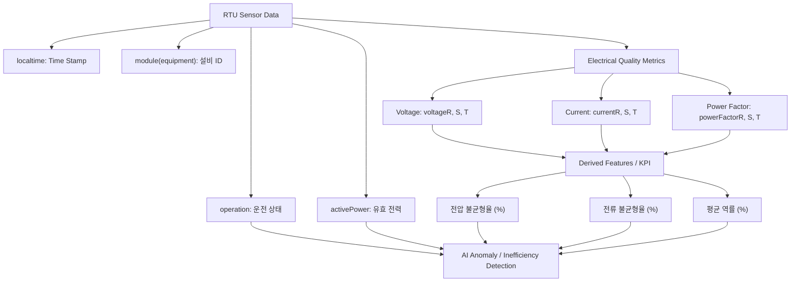
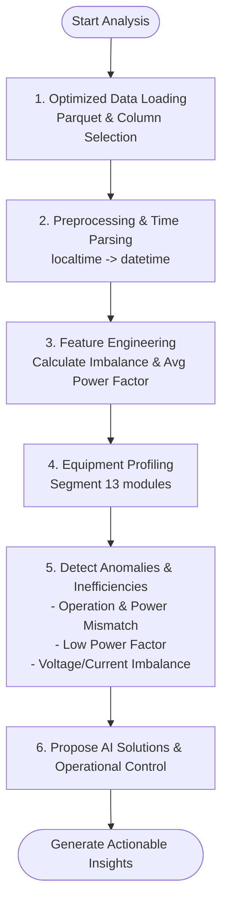

# 📊 데이터 센터 에너지 효율 분석 사전 가이드 (Untitled-1)

이 문서는 **AI 기술을 활용한 지속가능한 에너지 & 환경 솔루션 아이디어 공모전**에 참여하기에 앞서, 제공된 대용량 RTU 데이터를 효과적으로 분석하기 위해 반드시 숙지해야 하는 **데이터 변수 정보, 전기 도메인 배경지식, 분석 시 핵심 고려사항 및 유의사항**을 정리한 가이드라인입니다.

---

## 📌 목차
1. [📊 데이터 변수 명세서](#1--데이터-변수-명세서)
2. [💡 필수 전기 도메인 배경지식](#2--필수-전기-도메인-배경지식)
3. [🚀 데이터 분석 시 핵심 고려사항](#3--데이터-분석-시-핵심-고려사항)
4. [🔍 이상치 및 비효율 구간 탐지 모델 설계 방안](#4--이상치-및-비효율-구간-탐지-모델-설계-방안)
5. [⚠️ 전처리 및 개발 시 유의사항](#5--전처리-및-개발-시-유의사항)
6. [📚 선행 연구 및 분석 논리 설계](#6--선행-연구-및-분석-논리-설계)


---

## 1. 📊 데이터 변수 명세서

데이터 센터의 13개 주요 설비(예: 분쇄기, PM-3, 예비건조기 등)에 설치된 RTU(Remote Terminal Unit) 센서로부터 실시간 수집된 11개의 주요 변수 정보입니다.



| 변수명 | 데이터 타입 | 물리적 의미 / 단위 | 분석 시 역할 및 세부 설명 |
| :--- | :--- | :--- | :--- |
| **`module(equipment)`** | Object (String) | 설비 구분 (13종) | 데이터 센터 내 분석 대상 기기명 (예: 분쇄기, PM-3, 예비건조기, 분전반, 호이스트 등). 설비마다 기본 소비 전력 스케일과 기저 부하 특성이 다름. |
| **`localtime`** | Int64 / String | 측정 일시 (`YYYYMMDDhhmmss`) | 센서 데이터가 수집된 시점 (예: `20260705175400` $\rightarrow$ 2026년 7월 5일 17시 54분 00초). 시간별, 요일별(주중/주말) 전력 소비 주기성 분석의 기준이 됨. |
| **`operation`** | Int64 | 설비 운전 상태 (`0` 또는 `1`) | `0`: 정지(Stop) 상태, `1`: 가동(Run) 상태. 실제 운전 상태와 유효 전력 소비량 간의 불일치를 탐지하는 데 핵심적인 기준 변수. |
| **`activePower`** | Float64 | 유효 전력 (Active Power, `W`) | 설비가 실제로 작동하며 소비한 순수 전력량. 에너지 효율성 향상 및 피크 전력 관리를 위한 핵심 타깃 변수. |
| **`voltageR`<br>`voltageS`<br>`voltageT`** | Float64 | R, S, T 각 상의 전압 (`V`) | 산업용 3상 교류 전원의 개별 상별 전압값. 상 전압 간의 평형 상태를 계산하여 전력망의 안정성을 평가하는 데 사용됨. |
| **`currentR`<br>`currentS`<br>`currentT`** | Float64 | R, S, T 각 상의 전류 (`A`) | R, S, T 상에 흐르는 전류 크기. 특정 상에 과도한 부하가 걸리거나 모터 코일에 이상이 생겼을 때 발생하는 불균형을 탐지하는 지표. |
| **`powerFactorR`<br>`powerFactorS`<br>`powerFactorT`** | Float64 | R, S, T 각 상의 역률 (`%` 또는 `0~1`) | 공급된 총 전력 중 설비가 유효하게 사용한 전력의 비율. 역률이 낮을수록 송전 손실이 크고 전력 품질이 저하됨을 의미함. |

---

## 2. 💡 필수 전기 도메인 배경지식

데이터 센터 전력 데이터를 분석하기 위해 사전에 반드시 이해해야 하는 공학적 지식입니다.

### ① 3상 교류(3-Phase AC) 전력의 이해
* **산업용 표준 전력**: 일반 가정에서 쓰는 220V 단상 전력과 달리, 데이터 센터 및 대형 공장 설비는 전압 위상이 서로 $120^\circ$씩 어긋난 세 개의 도선(**R상, S상, T상**)을 사용하는 3상 전력을 사용합니다. 이는 대용량 모터나 랙 장비에 대전력을 안정적이고 효율적으로 공급하기 위함입니다.
* **상 평형의 중요성**: 정상적인 상태라면 R, S, T 상의 전압과 전류 크기는 서로 거의 같아야 합니다. 이를 **평형 상태**라고 합니다.

### ② 전압 및 전류 불평형 (Imbalance)
* **불평형 발생 원인**: 3상 부하가 특정 상에 편중되어 설계되었거나, 기기 내부(예: 모터 고정자 권선 등)의 전기적 결함이 발생하면 상 간의 전압·전류 균형이 깨집니다.
* **미치는 영향**: 
  - **전류 불균형**이 발생하면 모터 내부에 역상 자계가 형성되어 **비정상적인 과열(온도 상승)**을 유발합니다. 이는 모터 수명을 단축시키고 기기 고장의 원인이 됩니다.
  - 전원 장치의 에너지 효율이 저하되고 전력 손실이 급증합니다.
* **평가 공식**:
  * **전압 불균형율 (Voltage Imbalance)**:
    $$\text{전압 불균형율 (\%)} = \frac{\text{Max}(V_R, V_S, V_T) - \text{Min}(V_R, V_S, V_T)}{\text{Mean}(V_R, V_S, V_T)} \times 100$$
    *(통상적으로 **3% 이하**가 정상 가이드라인)*
  * **전류 불균형율 (Current Imbalance)**:
    $$\text{전류 불균형율 (\%)} = \frac{\text{Max}(I_R, I_S, I_T) - \text{Min}(I_R, I_S, I_T)}{\text{Mean}(I_R, I_S, I_T)} \times 100$$
    *(통상적으로 **30% 이하**가 안전 기준으로 권장됨)*

### ③ 유효 전력(Active Power)과 역률(Power Factor)
* **전력의 종류**:
  - **피상 전력 (Apparent Power, VA)**: 한국전력 등 발전원으로부터 실제로 공급받는 총 전력 ($P_{apparent} = \sqrt{3} \times V_{line} \times I_{line}$).
  - **유효 전력 (Active Power, W)**: 기계가 구동하여 열이나 물리적인 일로 소비한 실제 전력 (`activePower`).
  - **무효 전력 (Reactive Power, Var)**: 교류의 인덕턴스나 커패시턴스 성분 때문에 일을 하지 못하고 왕복 운동만 하며 소모되는 전력.
* **역률(Power Factor, $\cos\theta$)**: 피상전력 대비 유효전력의 비율입니다.
  $$\text{평균 역률 (\%)} = \frac{\text{powerFactorR} + \text{powerFactorS} + \text{powerFactorT}}{3}$$
  - **역률 저하의 영향**: 역률이 낮다는 것은 한전에서 보낸 전기를 유효하게 쓰지 못하고 낭비되는 무효전력이 많다는 뜻입니다. 이 경우 전선과 변압기에 과열이 발생하며, 한전에서는 일정 수준(일반적으로 90% 또는 0.9) 미만일 경우 벌금성 역률 요금을 부과합니다. 따라서 역률 개선 콘덴서를 사용해 이를 관리해야 합니다.

---

## 3. 🚀 데이터 분석 시 핵심 고려사항

### ① 대용량 데이터 처리 및 성능 최적화 (Memory Management)
* **Parquet 포맷 최우선 사용**: 원본 CSV 파일(`rtu_data_full.csv`)은 약 **4.9GB**로 매우 큽니다. 일반적인 개발 환경에서 `pd.read_csv`로 단순 로딩을 시도하면 메모리 초과(Out Of Memory)로 실행이 중단될 확률이 큽니다. 반면, 압축률과 칼럼 기반 저장 방식을 제공하는 **Parquet 포맷**(`rtu_data_full.parquet`, 약 1.48GB)을 사용하면 데이터를 읽는 속도가 현저히 빨라집니다.
* **필요한 컬럼 지정 로딩(Column-oriented Loading)**: 메모리를 절약하기 위해 전체 컬럼을 로드하기보다는, 당장 분석하려는 컬럼만 한정하여 로드해야 합니다.
  ```python
  import pandas as pd
  # 예: 설비별 전력 사용량 및 가동 패턴을 분석할 때
  df = pd.read_parquet('rtu_data_full.parquet', columns=['module(equipment)', 'localtime', 'activePower', 'operation'])
  ```

### ② 시간 데이터의 전처리 및 시계열 주기성
* **타임스탬프 파싱**: `localtime` 컬럼은 단순 정수형(`int64`)으로 기록되어 있으므로 시계열 데이터 가공이 불가능합니다. 분석 착수 전 반드시 `datetime` 타입으로 파싱하여 시간, 요일 등의 시간 변수를 생성해야 합니다.
  ```python
  df['localtime'] = pd.to_datetime(df['localtime'].astype(str), format='%Y%m%d%H%M%S')
  df['hour'] = df['localtime'].dt.hour
  df['weekday'] = df['localtime'].dt.weekday  # 0:월, 6:일
  ```
* **에너지 사용 패턴의 시계열적 특징**: 데이터 센터는 외부 기온, 업무 운영 시간(주중 vs 주말, 주간 vs 야간)에 따라 냉방 부하 및 서버 전력 소비량이 크게 요동칩니다. 이 주기성(Daily & Weekly Seasonality)을 파악하는 것이 패턴 분석의 시작입니다.

### ③ 설비별(Module) 특성 세분화
* 데이터 센터 내부의 13개 설비는 용도와 사양이 완전히 다릅니다. 예를 들어, **'분쇄기'**나 **'PM-3'**는 가동 시 순간적으로 엄청난 전력을 소비하지만, **'L-1전등'**이나 **'호이스트'**는 전력 스케일 자체가 작거나 불규칙적입니다.
* 모든 설비를 동일한 임계값(Threshold)으로 분석하면 전력량이 작은 기계의 이상징후를 감지할 수 없습니다. 따라서 **설비별로 개별 프로파일링 및 기준치(Baseline) 설정**을 분리하는 모델링 전략이 필수적입니다.

---

## 4. 🔍 이상치 및 비효율 구간 탐지 모델 설계 방안

공모전 예선 1단계 과제인 **"데이터 센터 에너지 사용 패턴 분석 및 비효율 구간 탐지 모델 설계"**를 위해 아래와 같은 기준을 수립할 수 있습니다.



### ① 운전 상태 불일치 기반 전력 낭비 탐지 (Rule-Based)
* **이상 정의**: 설비 운전 상태를 나타내는 `operation` 값이 **`0` (정지)**임에도 불구하고, 실제 소비 전력인 `activePower`가 기저 대기전력 수준을 크게 초과하여 높게 찍히는 구간입니다.
* **인사이트**: 장비가 오프라인 상태임에도 불필요하게 전력이 낭비되고 있거나, 운전 제어기(RTU) 또는 전류 측정 센서에 오류가 있음을 시사합니다.

### ② 3상 불평형 이상치 탐지 (Current/Voltage Imbalance Detection)
* **전류 불균형율이 30%를 초과하는 구간**을 탐지합니다. 
* **의의**: 전류 불균형은 열 손실과 모터 절연성 상실을 초래합니다. AI 기반 이상치 감지 모델(예: Isolation Forest)에 `current_imbalance`와 `activePower`를 입력 변수로 주어, 설비 이상 거동 및 과부하 위험군을 조기 차단하는 아이디어를 제안할 수 있습니다.

### ③ 무효 전력 차단을 위한 저역률 구간 탐지
* **평균 역률이 90% (또는 0.9) 미만**인 설비 및 시간대를 검출합니다.
* **해결 방안**: 전력 사용량이 매우 많은 피크 타임대에 역률이 극도로 떨어지는 현상이 특정 설비에서 빈번하게 관찰된다면, 해당 계통에 **'진상 콘덴서(Condenser)' 보완 장치 가동**을 제안하거나 AI 알고리즘을 이용한 **콘덴서 동적 제어 시나리오**를 도출할 수 있습니다.

### ④ 추천 AI 알고리즘
* **K-Means / GMM Clustering**: 주중/주말 및 시간대별 전력 소비량과 역률 특성을 군집화하여 정상적인 가동 패턴군과 비정상적인 전력 소비 패턴군 분류.
* **Isolation Forest**: 다변량 시계열(전력, 3상 전류 불균형, 평균 역률 등)에서 비지도 학습으로 돌발적인 이상 이벤트 구간 검출.
* **AutoEncoder (Deep Learning)**: 입력된 전력 지표 데이터를 부호화(Encoding) 및 복원(Decoding)하여, 복원 오차(Reconstruction Error)가 급증하는 구간을 설비의 이상징후 상태로 규정.

---

## 5. ⚠️ 전처리 및 개발 시 유의사항

> [!WARNING]
> 아래의 기술적인 오류 및 분석 함정을 피해 가야 모델의 신뢰성을 보장받을 수 있습니다.

### ① 나눗셈 연산 시 Zero Division (0 나누기) 방지
* 전압/전류 불균형율 계산 시 분모로 상의 평균값(`Mean`)을 사용합니다. 기기가 꺼져 있거나 전압 공급이 일시 중단된 시점에는 분모가 0이 되어 `NaN` 또는 `inf` 에러가 발생합니다.
* **방지 방안**: 분모에 아주 작은 소수값 $\epsilon = 10^{-5}$을 더해주거나, 분모가 0인 행을 연산에서 미리 제외시키는 마스킹 처리를 필수적으로 해야 합니다.
  ```python
  # 안전한 계산 예시
  c_mean = df[c_cols].mean(axis=1)
  df['current_imbalance'] = np.where(
      c_mean > 0,
      ((df[c_cols].max(axis=1) - df[c_cols].min(axis=1)) / c_mean) * 100,
      0.0  # 평균 전류가 0인 경우 불균형도 0으로 처리
  )
  ```

### ② 기기 정지 상태(`operation == 0`) 시의 왜곡 차단
* 기기가 정지(`operation == 0`)했을 때는 당연히 흐르는 전류가 매우 미미하거나 0에 가깝습니다. 이때 노이즈나 미세한 전류 불평형으로 인해 불균형율이 비정상적으로 높게 계산되는 경우가 있습니다.
* **방지 방안**: 기기가 정상 운전 중일 때(`operation == 1` 및 유효전력이 일정 수준 이상일 때)에 한해서만 3상 불평형 이상 상태를 판정하도록 필터링을 걸어야 노이즈성 알람(False Alarm)을 피할 수 있습니다.

### ③ 결측치(NaN) 및 센서 이상 데이터 전처리
* 센서 불량으로 특정 시점에 R, S, T 상 중 하나의 전류값만 0으로 떨어지는 결측 현상(단선 등)이 발생할 수 있습니다. 
* 이러한 물리적 고장 정보는 단순 결측치로 드롭(Drop)하지 말고, **센서/장비 고장 이벤트**로 간주하여 레이블링하거나 적절한 대체 기법(예: 전후 값의 보간법 선형 보정)을 신중히 선택해야 합니다.

### ④ 소스코드 품질 유지 및 가독성 확보 (공모전 필수 규정)
* 本 공모전은 수상 시 **채용 연계 가점 검토용으로 소스코드를 심사**합니다. 
* 소스코드의 가독성을 높이기 위해 **함수 단위 구조화**, **주석 작성**, 그리고 전체 데이터를 돌려보기 전에 작동 가능한 **샘플 데이터 중심 프로토타이핑 검증** 습관을 들여야 합니다.

---

## 6. 📚 선행 연구 및 분석 논리 설계 (Prior Research & Methodology)

공모전 본선 프레젠테이션 및 예선 보고서의 논리적 완성도를 높이기 위해, 학술적 연구 성과를 배경 논리로 채택하여 분석 모델의 당위성을 강화합니다.

### ① 대기전력 및 운전 상태 불일치 이상 탐지
* **논문 정보**: `전력 시계열 데이터를 이용한 비지도 설비 이상 패턴 탐지 방법 (이준희 외, 2024)`
* **선행 연구 요약**: 
  - 본 연구는 산업용 설비에서 실시간으로 수집되는 유효 전력 데이터를 활용하여 비지도 학습(Unsupervised Learning) 기반의 이상 패턴 검출 기법을 제안합니다. 특히, 별도의 사전 레이블(Label)이나 세부 도메인 지식 없이 정상 상태의 시계열 특징을 재구성하는 방식으로 이상을 탐지합니다.
* **본 분석 적용 및 스토리라인**:
  - **분석 변수 조합**: `operation` (운전 상태) + `activePower` (유효 전력 사용량)
  - **이상 상태 정의**: 설비 운전 제어 신호가 정지 상태(`operation == 0`)임에도 불구하고, 실제 소비되는 유효 전력(`activePower`)이 기기 고유의 정상 대기전력 임계치를 뚜렷하게 초과하는 비효율 전력 소모(대기전력 누수) 구간을 감지합니다.
  - **AI 방법론 (LSTM-Autoencoder) 당위성**:
    - 13개 주요 설비에서 발생하는 방대한 시계열 데이터를 사람이 일일이 규칙(Rule-based)으로 규정하는 것은 물리적 한계가 존재합니다.
    - 이를 위해 시계열 특징 추출에 탁월한 **LSTM-Autoencoder (LSTM-AE)** 모델을 적용합니다. 정상 작동 및 야간/주말 기저 전력 패턴을 오토인코더에 학습시킨 후, 실제 입력 데이터에 대해 발생하는 **재구성 오차 (Reconstruction Error)**를 계산합니다.
    - 재구성 오차가 임계치(Threshold)를 초과하는 구간을 "학습된 정상 패턴을 벗어난 에너지 낭비 또는 비정상 기동"으로 객관화하여 자동 탐지하도록 설계합니다.

### ② R, S, T 3상 역률 불평형 분석 및 시계열 결합
* **논문 정보**: `GFM 인버터의 전압 불평형율 개선을 위한 3상 밸런스 제어기 연구 (이호준 외, 2023)`
* **선행 연구 요약**:
  - 부하(설비)의 불평형(Imbalance) 상태는 전력 계통에 역상분 전류의 유입을 초래하며, 이는 송배전 및 인버터 설비의 수명을 치명적으로 단축시킬 뿐만 아니라 주변 연결 설비들의 오동작 및 에너지 손실을 유발하므로 3상 균형 제어가 필수적임을 수학적/실험적으로 증명하고 있습니다.
* **본 분석 적용 및 스토리라인**:
  - **분석 변수 조합**: `powerFactorR`, `powerFactorS`, `powerFactorT` (3상 개별 역률) + `localtime` (시간대)
  - **역률 편차 분석의 당위성**: 
    - 심사위원단에 "왜 단순히 평균 역률이나 총 유효 전력만 보지 않고 R, S, T 3상의 개별 역률을 다 쪼개서 분산 분석했는가?"에 대한 도메인 근거로 논문을 제시합니다.
    - R, S, T 상의 역률이 균형을 이루지 못하고 상 간 편차(표준편차)가 확대되는 구간을 탐지함으로써 설비 수명 보존 및 전력 손실 저감 측면에서의 분석 필요성을 입증합니다.
  - **시간대별 변수 융합 및 시각화**:
    - 파이썬 코드로 시간대별(`localtime`) R, S, T 역률의 표준편차를 도출합니다.
    - 설비의 시동 부하가 급증하는 오전 8시~9시 혹은 전력 소비가 극대화되는 특정 피크 타임에 3상의 평형 상태가 일시적으로 붕괴하는 현상을 Heatmap 또는 Line Plot으로 시각화합니다.
    - 이를 통해 "특정 시간대 및 설비 가동 패턴에 따른 3상 역률 불평형"을 가시화하고, 전력 품질 최적화를 위한 개선 방안의 핵심 인사이트로 삼습니다.

---

> [!TIP]
> 💡 **이후 분석을 위한 추천 액션**:  
> 현재 작업 중인 [Untitled-1.ipynb](file:///C:/Users/user/Desktop/lms공모전/Untitled-1.ipynb)에서 먼저 Parquet 데이터 1% 샘플을 로드해 본 뒤, 위의 공식을 활용하여 전류/전압 불균형율을 직접 시각화해 보는 것부터 시작해보세요!

